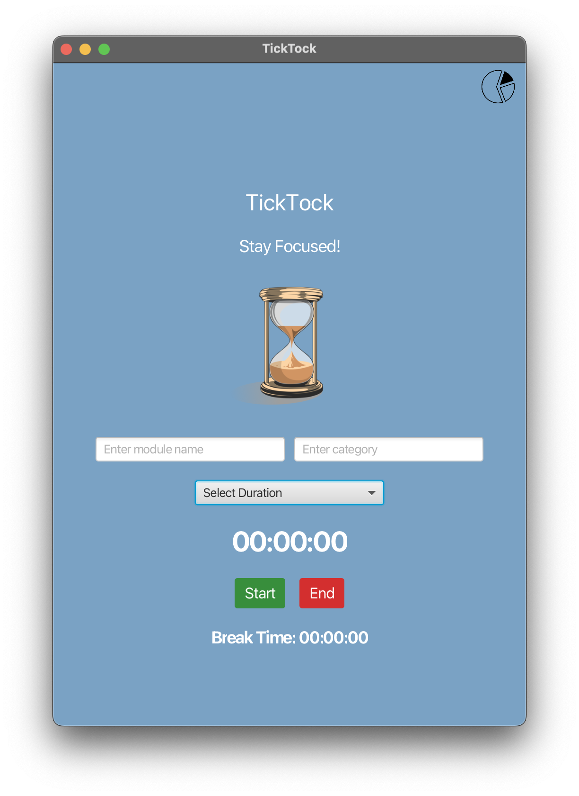
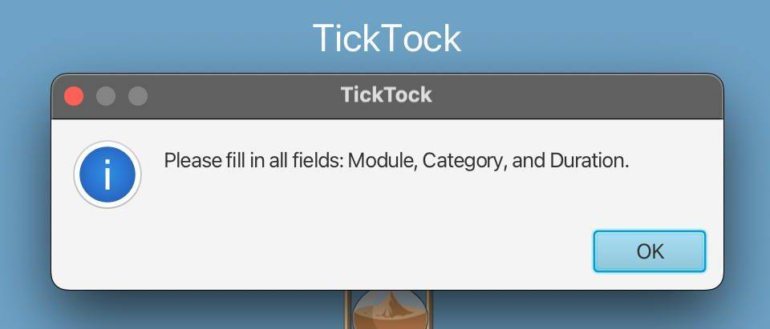
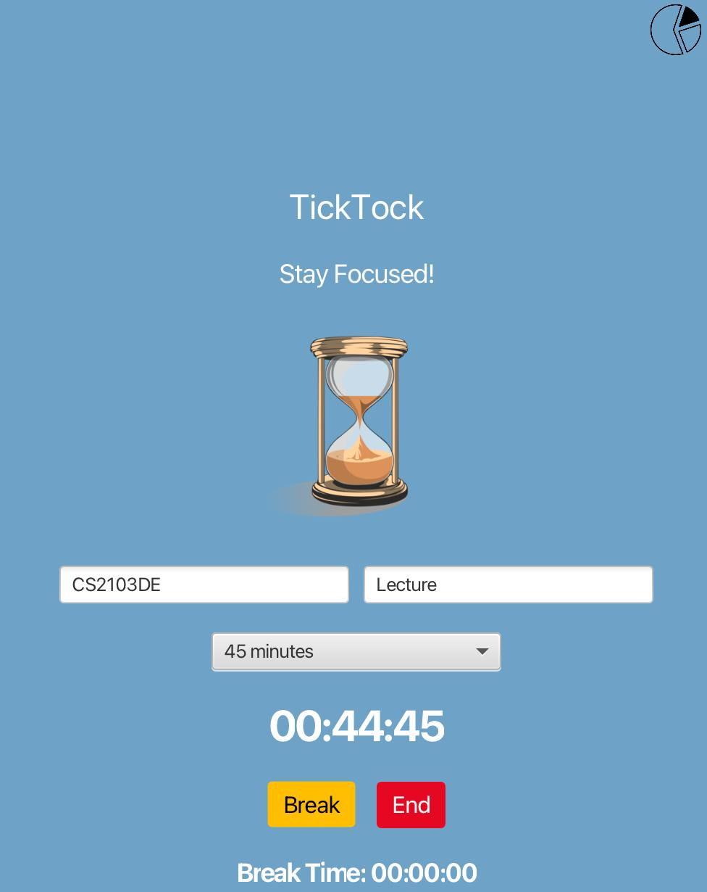
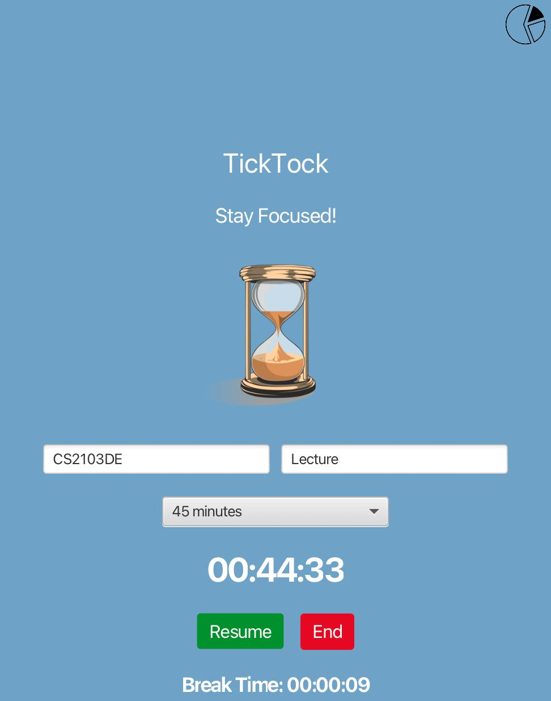
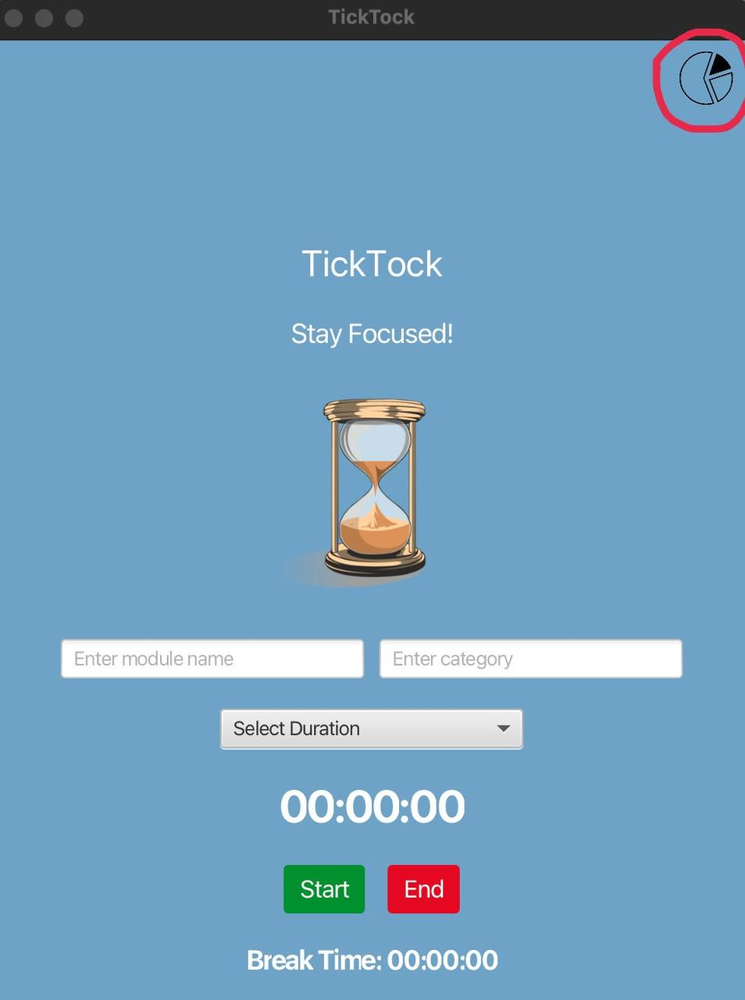
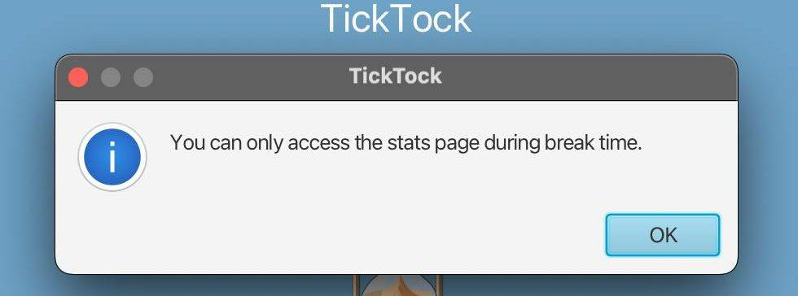
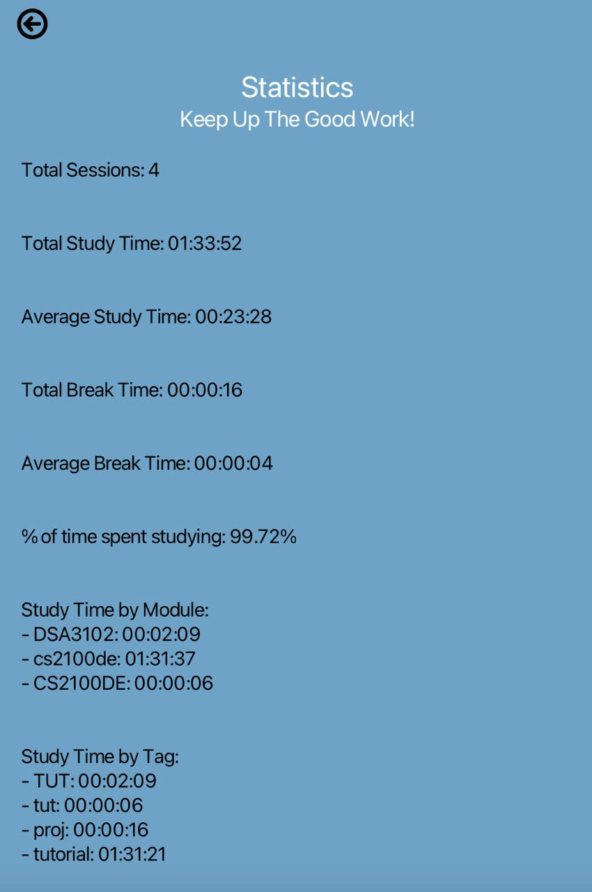

# Tick Tock User Guide

TickTock is a study timer app that allows you to track your study sessions by module, view your study history, and better understand how you manage your time across different subjects.

## Table of Contents
- [Getting Started](#getting-started)
- [Using TickTock](#using-ticktock)
    - [Starting a Study Session](#starting-a-study-session)
    - [Viewing Study History](#viewing-study-history)
- [Features](#features)
    - [Sessions](#sessions)
    - [Study Statistics](#study-insights)
- [Tips and Best Practices](#tips-and-best-practices)

## Getting Started 
- Ensure **Java 21** is installed on your computer.
- Download `tick-tock.jar` from [here](#). *(link)*
- Open your terminal.
- Navigate to the folder containing the `tick-tock.jar` file.
- Run the command: `java -jar tick-tock.jar`

## Using TickTock

### Starting a Study Session
To start a study session:

1. Launch the TickTock app.
2. Enter a module title (e.g., `CS2103DE`).
3. Enter a category (e.g., `Tutorial`).
4. Select a duration (e.g., `45 mins`). If either module, category or duration are not filled, you will see the alert **"Please fill in all fields: Module, Category, and Duration."**
   
5. Click **Start** to begin your session.
   
6. Click **Break** to start the break session.
   
7. Click **End** to end the study session. You will see the alert "Session Saved!"
   

To view study statistics:

1. When a session has not started or is currently on a break, click the **pie chart icon** located at the top right corner of the app window.
    If the session is ongoing and the user clicks the pie chart icon, the user will see the alert **"You can only access the stats page during break time or when the session has ended."**
   
2. A breakdown of your study history across previous sessions will be shown. This includes:

    - **Total Sessions**
    - **Total Study Time**
    - **Average Study Time**
    - **Total Break Time**
    - **Average Break Time**
    - **Percentage of Time Spent Studying**
    - **Study Time by Module**
    - **Study Time by Tag**
    
## Features 

### Sessions

The **Session** feature tracks individual study sessions, allowing users to associate them with a module and category, monitor time spent studying, and take breaks when needed.

- Users can start a session by selecting a duration, module, and category.
- The timer counts down from the selected duration and updates every second.
- Sessions can be paused and resumed at any time.
- Users can click **Break** to pause the session and start a break timer, then resume when ready.
- All sessions track metadata including:
    - Remaining study time
    - Total break time
    - Session duration
    - Module and category tags

### Study Statistics
Study statistics provide users with valuable insights into their study habits and overall productivity. By tracking and displaying data from past study sessions, TickTock helps users identify patterns, set realistic goals, and stay motivated.

These statistics include:

- **Total Sessions** – Number of study sessions completed.
- **Total Study Time** – Total duration spent actively studying.
- **Average Study Time** – Average length of a study session.
- **Total Break Time** – Total time spent on breaks.
- **Average Break Time** – Average length of a break.
- **Study Percentage** – Proportion of time spent studying compared to total session time (study + breaks).
- **Study Time by Module** - Time spent studying per module 
- **Study Time by Tag** - Time spent studying per category (lectures, tutorials, readings)

With these metrics, users can reflect on their consistency, evaluate time management, and make informed adjustments to improve their study routine.

